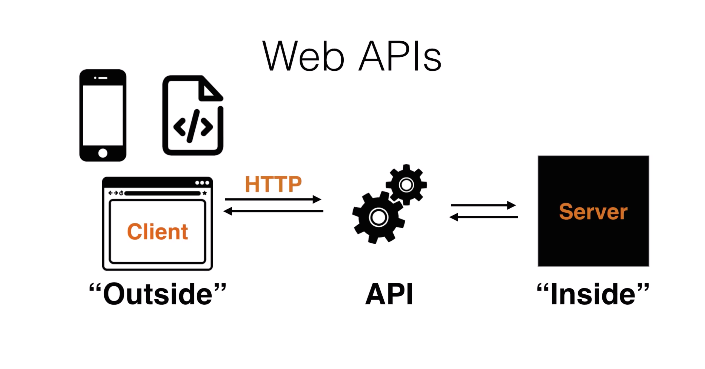
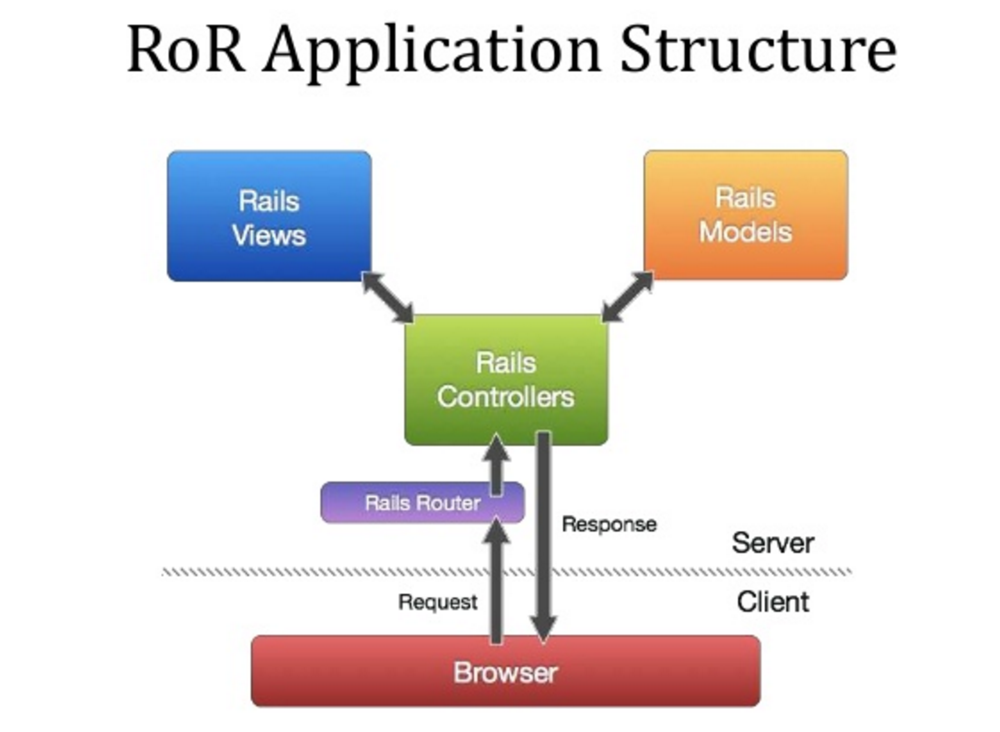
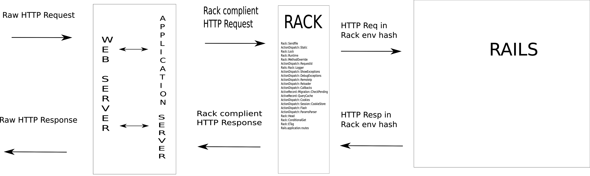
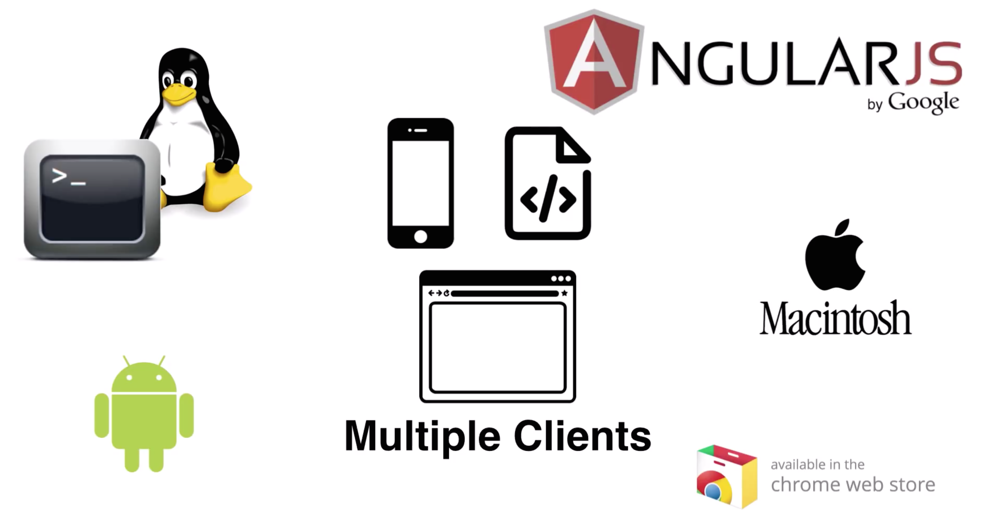

# RAILS API

Rails 5 is here(!!:tada:) and it has incorporated a new feature in its core implementation: **Rails API**, which was previously extracted into the gem: rails-api.

## WHAT IS AN API?

An API is piece of software interacting with other softwares by means of structured format.

A Web API basically is an interface between the outside and the inside where the outside (clients) and inside (servers) interact over HTTP. A Rails API programmatically interacts with other applications by providing JSON support. In itself, it has no HTML front end.



----

## Delving into the Rails API

Before doing that, let's clear up a few basics first. This is what a rails app looks from the outside:



Remove the views, and lighten the middleware stack and controller - you get a Rails API.

The best part about a rails API is that it provides a RESTful interface. The client asks for a resource, and gets a representation of that resource. The API only needs to respond to URIs and HTTP verbs with status code and the JSON response.

### CONFIGURATION

#### Creating a new Rails API

Rails API can be generated by:

`rails new my_api —api`

It does three basic things:

- Configures the application to start with a limited set of middleware.
- Configures the ApplicationController inherit from ActionController::API instead of ActionController::Base, which skips the inclusion of unnecessary modules.
- Configures the generators to skip generating views, helpers and assets when you generate a new resource.

So now when we do

`rails g scaffold todo title order:integer completed:boolean`

we get `todos_controller.rb` as:

```ruby
class TodosController < ApplicationController
  before_action :set_todo, only: [:show, :update, :destroy]

  # GET /todos
  def index
    @todos = Todo.all

    render json: @todos
  end

  # GET /todos/1
  def show
    render json: @todo
  end

  # POST /todos
  def create
    @todo = Todo.new(todo_params)

    if @todo.save
      render json: @todo, status: :created, location: @todo
    else
      render json: @todo.errors, status: :unprocessable_entity
    end
  end

  # PATCH/PUT /todos/1
  def update
    if @todo.update(todo_params)
      render json: @todo
    else
      render json: @todo.errors, status: :unprocessable_entity
    end
  end

  # DELETE /todos/1
  def destroy
    @todo.destroy
  end

  private
    # Use callbacks to share common setup or constraints between actions.
    def set_todo
      @todo = Todo.find(params[:id])
    end

    # Only allow a trusted parameter "white list" through.
    def todo_params
      params.require(:todo).permit(:title, :completed, :order)
    end
end

```

- Controllers need not have `new` and `edit` actions. These actions are used to render the HTML pages containing the forms where users fill the data to be added or modified in the system. It does not make sense in an API because this application is not longer responsible for rendering HTML pages.

- Controller only responds to JSON format. The usage of `respond_to` is no longer available.

- Also, the ApplicationController inherits from **ActionController::API** instead of ActionController:Base.

#### Routes generation

The routes generated will be:

```
Prefix Verb   URI Pattern          Controller#Action
 todos GET    /todos(.:format)     todos#index
       POST   /todos(.:format)     todos#create
  todo GET    /todos/:id(.:format) todos#show
       PATCH  /todos/:id(.:format) todos#update
       PUT    /todos/:id(.:format) todos#update
       DELETE /todos/:id(.:format) todos#destroy
```

Notice something? You got it right! There are no routes created for `:new` and `:edit`; and that's because we don't need them, too. This makes sense as we are creating an application with no HTML front end.

#### Config changes

In your `application.rb` you can require individual frameworks, allowing greater control over which frameworks are to be included: tailored to the needs of your application. It also has `config.api_only` set to true.

```ruby
require_relative 'boot'

require "rails"
# Pick the frameworks you want:
require "active_model/railtie"
require "active_record/railtie"
require "action_controller/railtie"

Bundler.require(*Rails.groups)

module ApiApp
  class Application < Rails::Application
    # Only loads a smaller set of middleware suitable for API only apps.
    # Middleware like session, flash, cookies can be added back manually.
    # Skip views, helpers and assets when generating a new resource.
    config.api_only = true
  end
end

```

- `turbolinks` and `jquery-rails` is not included by default in the Gemfile. That's because stuff related to asset management and template rendering is not needed in an API app.

- Views, helpers and assets are not generated, as they do not make sense in an API.

#### Middleware

Middleware are Rack Applications. They act as filters in the request-response cycle. Each request passes through the middleware stack before entering the rails MVC framework. Rails provides flexibility in it's middleware stack in the sense that we can insert our own middleware in between the stack; provided it does not break the chain and calls the next middleware in line.



Rails provides a hefty yet efficient and a very useful middleware stack.

The Rails API by default includes the following middleware:

- Rack::Sendfile: Sets server-specific X-sendfile headers.
- ActionDispatch::Static: Serves static files from public directory.
- ActiveSupport::Cache::Strategy::LocalCache::Middleware: Memory caching (not thread safe).
- Rack::Runtime: Sets X-runtime header storing the time taken to execute each request.
- ActionDispatch::RequestId: Provides X-request-id header to response. Enables ActionDispatch::Request#request_id.
- Rails::Rack::Logger: Notifies logs that request has began. Flushes all logs after request is completed.
- ActionDispatch::ShowExceptions: Rescues any exception returned by app and calls a user-friendly exception wrapper app.
- ActionDispatch::DebugExceptions: Logs exceptions and shows debugging page if request is local.
- ActionDispatch::RemoteIp: Checks for IP spoofing attacks.
- ActionDispatch::Reloader: Provides prepare and cleanup callbacks for code reloading.
- ActionDispatch::Callbacks: Provides callbacks to be executed before and after request.
- ActiveRecord::Migration::CheckPending: Checks pending migrations, raises exception.
- Rack::Head: Converts HEAD requests to GET requests and returns only status code and headers.
- Rack::ConditionalGet: Adds support for Conditional GET and the stale? method in rails controllers.
- Rack::ETag: Adds ETag header on all string responses. If the same response is returned by the controller on for the same URL, the server will return a 304(not modified) response, even if caching is not performed (Client-side optimisation: reduces bandwidth cost but not server processing time.
- Rails.application.routes: Specifies the routes for the application.

These middleware are agnostic to the type of application and make sense in an API-only app. Other plugins like ActiveRecord, and the gems (like devise, cors etc.) added by the programmer can add additional middleware.

>Apart from these, you can add middleware as per your requirements.

Rails provides the following middleware in a full-fledged Rails app which can be added to an API app:

- Rack::Lock- Sets env["rack.multithread"] flag to false and wraps the application within a Mutex.
- Rack::MethodOverride: Allows the method to be overridden if params[:_ method] is present (for PUT and DELETE requests)
- WebConsole::Middleware
- ActiveRecord::ConnectionAdapters::ConnectionManagement: Cleans active connections after each request, unless rack.test = true.
- ActiveRecord::QueryCache: Enables active record query cache.
- ActionDispatch::Cookies: Sets cookies for request.
- ActionDispatch::Session::CookieStore: Stores session in cookies.
- ActionDispatch::Flash: Sets flash keys (only if config.action_controller session_store has a value).
- ActionDispatch::ParamsParser: Parse XML, YAML and JSON parameters when the request’s Content-Type is one of those.

Additional middleware can be added by:

>config.middleware.use(new_middleware, args): Adds to the bottom of the stack.
>
config.middleware.insert_before(existing_middleware, new_middleware, args): Adds the new middleware before the specified existing middleware in the middleware stack.
>
config.middleware.insert_after(existing_middleware, new_middleware, args): Adds the new middleware after the specified existing middleware in the middleware stack.

For deletion, use:

>config.middleware.delete(existing_middleware)

Controller Modules

The Rails API controllers inherit from ActionController::API and come with the following modules:

- ActionController::UrlFor: Makes url_for and friends available
- ActionController::Redirecting: Support for redirect_to
- ActionController::Rendering: Basic support for rendering
- ActionController::Renderers::All: Support for render :json and friends
- ActionController::ConditionalGet: Support for stale?
- ActionController::ForceSSL: Support for force_ssl
- ActionController::DataStreaming: Support for send_file and send_data
- AbstractController::Callbacks: Support for before_filter and friends
- ActionController::Instrumentation: Support for the instrumentation hooks defined by ActionController (see the source for more).
- ActionController::Rescue: Support for rescue_from.
- ActionController::Serialization: Support for JSON serialization.
- ActiveRecord::Railties::ControllerRuntime
- ActionDispatch::Routing::RouteSet::MountedHelpers
- ActionController::ParamsWrapper
- ActiveSupport::Callbacks
- ActionController::StrongParameters
- ActiveSupport::Rescuable
- ActionController::BasicImplicitRender
- ActionController::Head
- ActionController::ApiRendering
- ActiveSupport::Benchmarkable
- AbstractController::Logger
- AbstractController::UrlFor
- ActionDispatch::Routing::UrlFor
- ActionDispatch::Routing::PolymorphicRoutes

>Any additional modules can be added to ApplicationController or to individual controllers.

#### Caching in Rails API

In HTTP there's a thing called Conditional Get. It means that if a clients makes a request for a particular resource, and if the resource has not changed, they should not get the list again, and just go back to the browser cache, or whatever caching mechanism has been used and get the resource from there. Rails API implements this using Rack::ConditionalGet which sets the eTag (a string that identifies the version of a resource) and the last_modified response headers (when was this resource last modified?) and provides the `stale?` method to the controllers.

For example, in our controller:

```ruby
def show
  if stale?(etag: @todo, last_modified: @todo.updated_at)
    @todo.expensive_method_call
    render json: @todo
  end
end
```

This means that the cache middleware will store off the Last-Modified value for a URL in the Rails cache, and add an If-Modified-Since header to any subsequent inbound requests for the same URL. When the first GET request is sent, the eTag and last_modified headers are set, and when we send the request the next time, the headers will be checked against their previous values. If nothing has changed, a 304 not modified response is sent.

Adding caching to your application is useful as it speeds up your application without much ado. Fragment caching is especially helpful when building up a nested JSON object.

#### CORS in Rails API

Browsers have this problem called the Same Origin Policy Problem, which means that if someone is trying to make an AJAX request from a browser to your server, the two need to be under the same domain name. This puts us in a fix if our front end application is under a different domain name or if we want someone else to build our front end application based on top of our platform. We can get this support using the `rack-cors` gem.

To enable it, add the following line to your `Gemfile`:

`gem 'rack-cors'`

Then to your `config/initializers/cors.rb` add:

```ruby
Rails.application.config.middleware.insert_before 0, "Rack::Cors" do
   allow do
     origins '*' # or insert the origins you want to allow

     resource '*', # you can include individual resources if need be
       headers: :any,
       methods: [:get, :post, :put, :patch, :delete, :options, :head]
   end
 end
```

#### USING RAILS API WITH JSON

By default, API mode just relies on #to_json calls on model classes. But you can either use [Jbuilder](https://github.com/rails/jbuilder), [Active Model Serializers](https://github.com/rails-api/active_model_serializers), or look at the new [JSONAPI::Resources](https://github.com/cerebris/jsonapi-resources) project for a more advanced solution.
The first beta release of Rails 5 had AMS as the default JSON parser but the new RC does not have any serialization gems by default.

Let's use AMS for our API.

We'll need to add the following line to our Gemfile:

`gem 'active_model_serializers', '~> 0.10.0.rc1'`

This creates a serializers folder in our app directory and adds the serializer for the models in your API. In our case, it will create todo_serializer.rb. We can add the attributes we want to send via our API.

```ruby
class TodoSerializer < ActiveModel::Serializer
  attributes :id, :title, :completed, :order
end
```

## WHY USE RAILS API INSTEAD OF RAILS?

Rails API provides a trimmed-down version of Rails which can be used with other front end frameworks like Backbone, EmberJS etc. They will interact very well with a Rails API as it is a uniform API, it follows conventions.

[Here's](https://wyeworks.com/blog/2015/6/11/how-to-build-a-rails-5-api-only-and-backbone-application/) a great tutorial of how to build a rails 5 API-only and backbone application. And [here's](https://wyeworks.com/blog/2015/6/30/how-to-build-a-rails-5-api-only-and-ember-application/) one for EmberJS.

Rails 5 API has only the basic functionality of necessary middleware, slimmed-down controllers, routes and serializers, without the paraphernalia of views, helpers, template generation and asset pipelining. It also skips cookie support.

If you're building a RESTful JSON API, you want to be using the Rails router. Clean and conventional mapping from HTTP to controllers means not having to spend time thinking about how to model your API in terms of HTTP.

The flexibility provided by a Rails API enables it to be agnostic to the type of application it is being used with and provides a programmer-friendly, easy-to-use environment. The advantage of building an API is simple - having multiple clients. It gives you a lot of flexibility. The popularity for front end applications is high, and an API facilitates the use of the same. You can separate out your front end as an independent app, build a native mobile app, desktop apps and even chrome extensions! The possibilities are endless..



Now, coming to performance issues, a Rails 5 API-only application is much faster and memory efficient than a Rails-only application. This is pretty obvious as it has a slimmer middleware stack (it has 16 middlewares whereas a normal rails application has 25 - considering only the ones included by default, not by external frameworks), and ActionController::API does not include the extra 21 modules included ActionController::Base.

Comparing our API-only app with a normal rails application having 50 records, we get the following stats:

Response time:
- Rails API: 8 ms
- Rails App: 27 ms

Memory consumption:
- Rails API: 48 mb
- Rails App: 80 mb

That's an approximate 70% increase in response time and a 40% reduction in memory consumption. Huge, isn't it? That's a lot considering whatever overheads will be caused by your front end application(s).

So now you have the keys to the castle, and all the basics for building an API the Rails way. Happy coding!
